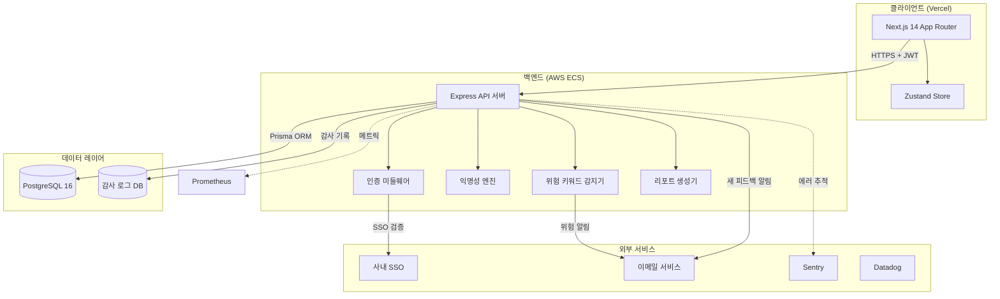
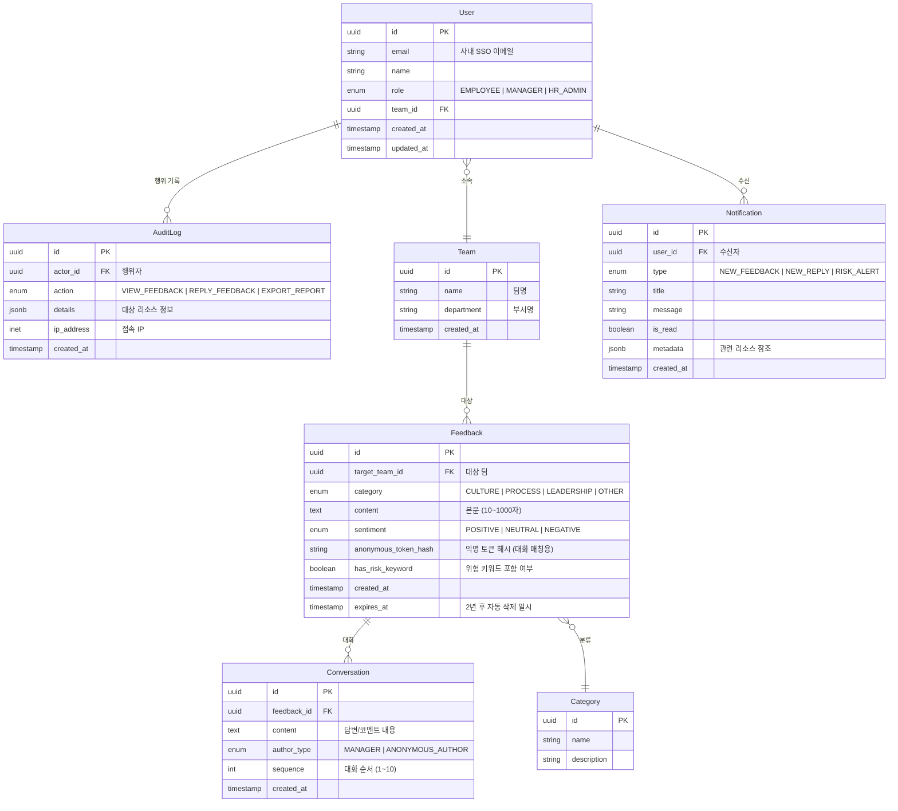
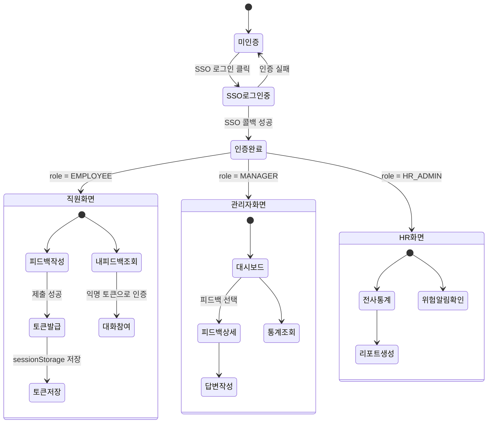
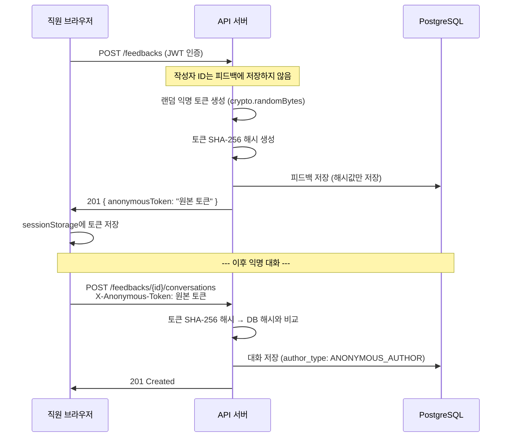
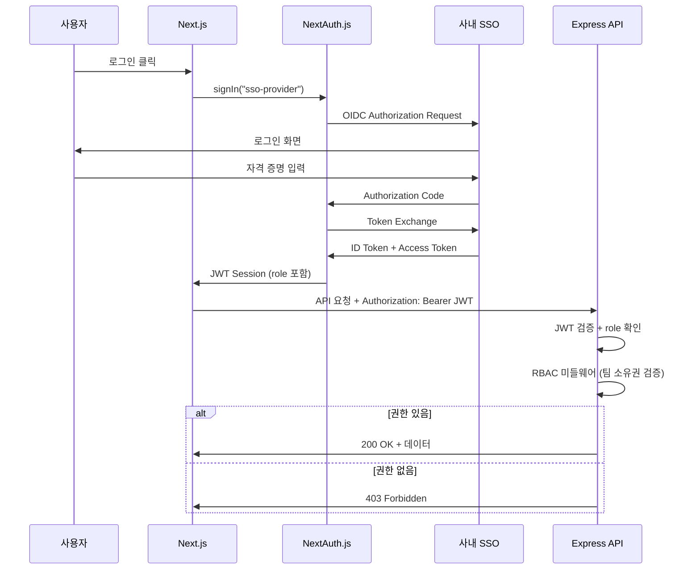

# 시스템 설계서: AnonVoice

## 1. 프로젝트 개요

| 항목 | 내용 |
|---|---|
| 프로젝트명 | AnonVoice |
| 한 줄 설명 | 직원이 익명으로 팀/조직에 피드백을 남기고, 관리자가 대시보드로 확인하는 사내 서비스 |
| 기술 스택 | React 18 + Next.js 14, Zustand, Tailwind CSS + shadcn/ui, Node.js + Express, PostgreSQL 16, Prisma, NextAuth.js, Vercel + Kubernetes |
| 작성일 | 2026-03-26 |
| 기반 문서 | prd.md |

---

## 2. 전체 시스템 아키텍처



**핵심 설계 원칙:**
- 피드백 작성자의 신원과 피드백 사이에 **어떤 매핑 정보도 서버에 저장하지 않음**
- 익명 대화를 위한 1회용 토큰은 클라이언트에만 보관
- 관리자 행위는 모두 감사 로그에 기록

---

## 3. 데이터베이스 모델링

### 3.1 ERD



### 3.2 테이블 상세 명세

#### Feedback 테이블

| 컬럼명 | 타입 | 제약조건 | 설명 |
|---|---|---|---|
| id | UUID | PK, DEFAULT gen_random_uuid() | 피드백 고유 ID |
| target_team_id | UUID | FK(Team.id), NOT NULL | 피드백 대상 팀 |
| category | ENUM | NOT NULL | CULTURE, PROCESS, LEADERSHIP, OTHER |
| content | TEXT | NOT NULL, CHECK(length 10~1000) | 피드백 본문 |
| sentiment | ENUM | NOT NULL | POSITIVE, NEUTRAL, NEGATIVE |
| anonymous_token_hash | VARCHAR(128) | NOT NULL, UNIQUE | 익명 토큰의 SHA-256 해시값 |
| has_risk_keyword | BOOLEAN | DEFAULT false | 위험 키워드 포함 여부 |
| created_at | TIMESTAMPTZ | DEFAULT now() | 작성 시각 |
| expires_at | TIMESTAMPTZ | NOT NULL | 2년 후 자동 삭제 일시 |

**인덱스 전략:**
- `idx_feedback_target_team` — target_team_id (팀별 조회)
- `idx_feedback_category` — category (카테고리 필터)
- `idx_feedback_created_at` — created_at DESC (최신순 정렬)
- `idx_feedback_expires_at` — expires_at (만료 데이터 삭제 배치)
- `idx_feedback_sentiment` — sentiment (감정 통계)

#### Conversation 테이블

| 컬럼명 | 타입 | 제약조건 | 설명 |
|---|---|---|---|
| id | UUID | PK | 대화 고유 ID |
| feedback_id | UUID | FK(Feedback.id), NOT NULL | 소속 피드백 |
| content | TEXT | NOT NULL, CHECK(length 1~500) | 답변/코멘트 내용 |
| author_type | ENUM | NOT NULL | MANAGER 또는 ANONYMOUS_AUTHOR |
| sequence | INT | NOT NULL, CHECK(1~10) | 대화 순서 (최대 5회 왕복 = 10) |
| created_at | TIMESTAMPTZ | DEFAULT now() | 작성 시각 |

**인덱스:** `idx_conversation_feedback` — feedback_id, sequence ASC

#### AuditLog 테이블

| 컬럼명 | 타입 | 제약조건 | 설명 |
|---|---|---|---|
| id | UUID | PK | 로그 고유 ID |
| actor_id | UUID | FK(User.id), NOT NULL | 행위자 |
| action | ENUM | NOT NULL | VIEW_FEEDBACK, REPLY_FEEDBACK, EXPORT_REPORT |
| details | JSONB | NOT NULL | 대상 리소스 정보 (피드백 ID 등) |
| ip_address | INET | NOT NULL | 접속 IP |
| created_at | TIMESTAMPTZ | DEFAULT now() | 기록 시각 |

**인덱스:** `idx_audit_actor` — actor_id, created_at DESC

#### Notification 테이블

| 컬럼명 | 타입 | 제약조건 | 설명 |
|---|---|---|---|
| id | UUID | PK | 알림 고유 ID |
| user_id | UUID | FK(User.id), NOT NULL | 수신자 |
| type | ENUM | NOT NULL | NEW_FEEDBACK, NEW_REPLY, RISK_ALERT |
| title | VARCHAR(200) | NOT NULL | 알림 제목 |
| message | TEXT | NOT NULL | 알림 본문 |
| is_read | BOOLEAN | DEFAULT false | 읽음 여부 |
| metadata | JSONB | | 관련 리소스 참조 |
| created_at | TIMESTAMPTZ | DEFAULT now() | 생성 시각 |

**인덱스:** `idx_notification_user_unread` — user_id, is_read WHERE is_read = false

---

## 4. 핵심 API 인터페이스 명세

모든 API는 `Authorization: Bearer <JWT>` 헤더 필수. 에러 응답은 RFC 7807 형식.

### 4.1 피드백

#### POST /api/v1/feedbacks
**설명**: 익명 피드백 작성
**인증**: Bearer Token 필수 (직원 이상)
**중요**: 서버는 작성자 ID를 피드백과 연결하여 저장하지 않음

**Request Body**:
```json
{
  "targetTeamId": "uuid (required)",
  "category": "string (enum: CULTURE, PROCESS, LEADERSHIP, OTHER)",
  "content": "string (required, 10~1000자)",
  "sentiment": "string (enum: POSITIVE, NEUTRAL, NEGATIVE)"
}
```

**Response 201**:
```json
{
  "feedbackId": "uuid",
  "anonymousToken": "string (1회용 익명 토큰 — 클라이언트에서만 보관)",
  "createdAt": "ISO 8601"
}
```

**에러 응답**:

| 코드 | type | 설명 |
|---|---|---|
| 400 | INVALID_INPUT | 필수 필드 누락 또는 본문 길이 위반 |
| 401 | UNAUTHORIZED | 인증 토큰 없음/만료 |

#### GET /api/v1/feedbacks?teamId={uuid}&category={enum}&page={n}&size={n}
**설명**: 팀별 피드백 목록 조회 (관리자용)
**인증**: Bearer Token 필수 (MANAGER — 자기 팀만, HR_ADMIN — 전체)

**Query Params**:

| 파라미터 | 타입 | 필수 | 설명 |
|---|---|---|---|
| teamId | UUID | Y (MANAGER) | 대상 팀 ID |
| category | ENUM | N | 카테고리 필터 |
| sentiment | ENUM | N | 감정 필터 |
| page | INT | N (기본 1) | 페이지 번호 |
| size | INT | N (기본 20, 최대 50) | 페이지 크기 |

**Response 200**:
```json
{
  "items": [
    {
      "id": "uuid",
      "category": "CULTURE",
      "content": "피드백 내용...",
      "sentiment": "POSITIVE",
      "conversationCount": 2,
      "createdAt": "ISO 8601"
    }
  ],
  "pagination": {
    "page": 1,
    "size": 20,
    "totalItems": 45,
    "totalPages": 3
  }
}
```

**에러 응답**:

| 코드 | type | 설명 |
|---|---|---|
| 403 | FORBIDDEN | 다른 팀의 피드백 열람 시도 |

### 4.2 익명 대화

#### POST /api/v1/feedbacks/{feedbackId}/conversations
**설명**: 피드백에 답변 또는 익명 코멘트 작성
**인증**: 관리자 — Bearer Token / 익명 작성자 — anonymousToken 헤더

**Request Body**:
```json
{
  "content": "string (required, 1~500자)"
}
```

**Request Headers** (익명 작성자인 경우):
```
X-Anonymous-Token: {1회용 익명 토큰}
```

**Response 201**:
```json
{
  "conversationId": "uuid",
  "sequence": 3,
  "authorType": "ANONYMOUS_AUTHOR",
  "createdAt": "ISO 8601"
}
```

**에러 응답**:

| 코드 | type | 설명 |
|---|---|---|
| 400 | MAX_CONVERSATION_REACHED | 최대 대화 횟수(5회 왕복) 초과 |
| 403 | INVALID_TOKEN | 익명 토큰 불일치 |
| 404 | NOT_FOUND | 피드백 없음 |

#### GET /api/v1/feedbacks/{feedbackId}/conversations
**설명**: 피드백 대화 쓰레드 조회
**인증**: 관리자 — Bearer Token / 익명 작성자 — X-Anonymous-Token 헤더

**Response 200**:
```json
{
  "feedbackId": "uuid",
  "conversations": [
    {
      "id": "uuid",
      "content": "답변 내용...",
      "authorType": "MANAGER",
      "sequence": 1,
      "createdAt": "ISO 8601"
    }
  ]
}
```

### 4.3 통계

#### GET /api/v1/stats/sentiment?teamId={uuid}&period={enum}
**설명**: 감정 분포 통계
**인증**: MANAGER (자기 팀) 또는 HR_ADMIN (전체)

**Query Params**:

| 파라미터 | 타입 | 필수 | 설명 |
|---|---|---|---|
| teamId | UUID | Y (MANAGER) | 대상 팀 |
| period | ENUM | N (기본 MONTHLY) | WEEKLY, MONTHLY, QUARTERLY |

**Response 200**:
```json
{
  "period": "MONTHLY",
  "data": [
    {
      "label": "2026-03",
      "positive": 12,
      "neutral": 8,
      "negative": 3,
      "total": 23
    }
  ]
}
```

#### GET /api/v1/stats/keywords?teamId={uuid}
**설명**: 키워드 워드클라우드 데이터
**인증**: MANAGER 또는 HR_ADMIN

**Response 200**:
```json
{
  "keywords": [
    { "word": "소통", "count": 15 },
    { "word": "야근", "count": 8 }
  ]
}
```

#### GET /api/v1/stats/participation?period={enum}
**설명**: 참여율 통계
**인증**: HR_ADMIN 전용

**Response 200**:
```json
{
  "period": "QUARTERLY",
  "data": [
    {
      "teamName": "개발팀",
      "feedbackCount": 45,
      "participationRate": 0.78
    }
  ]
}
```

### 4.4 알림

#### GET /api/v1/notifications?unreadOnly={bool}&page={n}
**설명**: 내 알림 목록 조회
**인증**: Bearer Token 필수

**Response 200**:
```json
{
  "items": [
    {
      "id": "uuid",
      "type": "NEW_REPLY",
      "title": "피드백에 답변이 달렸습니다",
      "message": "...",
      "isRead": false,
      "metadata": { "feedbackId": "uuid" },
      "createdAt": "ISO 8601"
    }
  ],
  "unreadCount": 3
}
```

#### PATCH /api/v1/notifications/{notificationId}/read
**설명**: 알림 읽음 처리
**인증**: Bearer Token 필수

**Response 204**: No Content

### 4.5 리포트

#### POST /api/v1/reports/generate
**설명**: 분기별 리포트 생성 요청
**인증**: HR_ADMIN 전용

**Request Body**:
```json
{
  "quarter": "2026-Q1",
  "teamIds": ["uuid"]
}
```

**Response 202**:
```json
{
  "reportId": "uuid",
  "status": "GENERATING",
  "estimatedCompletionAt": "ISO 8601"
}
```

#### GET /api/v1/reports/{reportId}
**설명**: 생성된 리포트 다운로드
**인증**: HR_ADMIN 전용

**Response 200**: PDF 파일 (Content-Type: application/pdf)

### 4.6 팀 정보

#### GET /api/v1/teams
**설명**: 팀 목록 조회
**인증**: Bearer Token 필수

**Response 200**:
```json
{
  "teams": [
    {
      "id": "uuid",
      "name": "개발팀",
      "department": "기술본부"
    }
  ]
}
```

---

## 5. 폴더 구조 및 컴포넌트 분리 전략

```
anonvoice/
├── frontend/                    # Next.js 14 프론트엔드 (Vercel 배포)
│   ├── src/
│   │   ├── app/                 # App Router 페이지
│   │   │   ├── layout.tsx       # 루트 레이아웃
│   │   │   ├── page.tsx         # 랜딩/리다이렉트
│   │   │   ├── login/
│   │   │   │   └── page.tsx     # SSO 로그인
│   │   │   ├── feedback/
│   │   │   │   ├── new/
│   │   │   │   │   └── page.tsx # 피드백 작성
│   │   │   │   └── mine/
│   │   │   │       └── page.tsx # 내 피드백 목록
│   │   │   ├── dashboard/
│   │   │   │   ├── page.tsx     # 관리자 대시보드
│   │   │   │   └── [feedbackId]/
│   │   │   │       └── page.tsx # 피드백 상세 + 대화
│   │   │   └── hr/
│   │   │       ├── page.tsx     # HR 대시보드
│   │   │       └── reports/
│   │   │           └── page.tsx # 리포트 관리
│   │   ├── components/          # 재사용 UI 컴포넌트
│   │   │   ├── ui/              # shadcn/ui 기반 원자 컴포넌트
│   │   │   ├── feedback/        # 피드백 관련 컴포넌트
│   │   │   │   ├── FeedbackForm.tsx
│   │   │   │   ├── FeedbackCard.tsx
│   │   │   │   └── ConversationThread.tsx
│   │   │   ├── dashboard/       # 대시보드 관련 컴포넌트
│   │   │   │   ├── SentimentChart.tsx
│   │   │   │   ├── TrendGraph.tsx
│   │   │   │   └── WordCloud.tsx
│   │   │   ├── notification/
│   │   │   │   └── NotificationBell.tsx
│   │   │   └── layout/
│   │   │       ├── Header.tsx
│   │   │       ├── Sidebar.tsx
│   │   │       └── RoleGuard.tsx
│   │   ├── hooks/               # 커스텀 훅
│   │   │   ├── useFeedbacks.ts
│   │   │   ├── useNotifications.ts
│   │   │   └── useStats.ts
│   │   ├── services/            # API 통신 레이어
│   │   │   ├── api.ts           # Axios 인스턴스 + 인터셉터
│   │   │   ├── feedbackService.ts
│   │   │   ├── statsService.ts
│   │   │   └── notificationService.ts
│   │   ├── stores/              # Zustand 스토어
│   │   │   ├── authStore.ts
│   │   │   ├── feedbackStore.ts
│   │   │   └── notificationStore.ts
│   │   ├── types/               # TypeScript 타입 정의
│   │   │   ├── feedback.ts
│   │   │   ├── user.ts
│   │   │   └── api.ts
│   │   └── utils/               # 유틸리티
│   │       ├── anonymousToken.ts  # 익명 토큰 로컬 관리
│   │       └── formatters.ts
│   ├── .env.local               # 환경변수 (gitignore)
│   ├── next.config.js
│   ├── tailwind.config.ts
│   └── package.json
│
├── backend/                     # Express API 서버 (AWS ECS 배포)
│   ├── src/
│   │   ├── app.ts               # Express 앱 설정
│   │   ├── server.ts            # 서버 진입점
│   │   ├── routes/              # 라우트 정의
│   │   │   ├── feedbackRoutes.ts
│   │   │   ├── conversationRoutes.ts
│   │   │   ├── statsRoutes.ts
│   │   │   ├── notificationRoutes.ts
│   │   │   ├── reportRoutes.ts
│   │   │   └── teamRoutes.ts
│   │   ├── controllers/         # 요청/응답 처리
│   │   │   ├── feedbackController.ts
│   │   │   ├── conversationController.ts
│   │   │   ├── statsController.ts
│   │   │   ├── notificationController.ts
│   │   │   └── reportController.ts
│   │   ├── services/            # 비즈니스 로직
│   │   │   ├── feedbackService.ts
│   │   │   ├── conversationService.ts
│   │   │   ├── statsService.ts
│   │   │   ├── keywordDetector.ts   # 위험 키워드 감지
│   │   │   ├── reportGenerator.ts   # PDF 리포트 생성
│   │   │   └── notificationService.ts
│   │   ├── middleware/          # 미들웨어
│   │   │   ├── auth.ts          # JWT 검증
│   │   │   ├── rbac.ts          # 역할 기반 접근 제어
│   │   │   ├── auditLogger.ts   # 감사 로그 기록
│   │   │   ├── rateLimiter.ts   # Rate Limiting
│   │   │   ├── validator.ts     # 입력 검증 (Zod)
│   │   │   └── errorHandler.ts  # RFC 7807 에러 처리
│   │   ├── models/              # Prisma 스키마 연동 타입
│   │   ├── utils/
│   │   │   ├── crypto.ts        # 토큰 해싱 (SHA-256)
│   │   │   └── sanitizer.ts     # 입력 Sanitization
│   │   └── types/
│   │       └── express.d.ts     # Express 타입 확장
│   ├── prisma/
│   │   ├── schema.prisma        # Prisma 스키마
│   │   └── migrations/          # 마이그레이션 파일
│   ├── .env                     # 환경변수 (gitignore)
│   └── package.json
│
├── .github/
│   └── workflows/               # CI/CD
├── docker-compose.yml           # 로컬 개발 환경
└── README.md
```

**컴포넌트 분리 기준:**
- **프론트엔드**: 페이지(app/) → 도메인별 컴포넌트(components/) → 공통 UI(ui/) 3단계 분리
- **백엔드**: Route → Controller → Service 레이어 패턴. 비즈니스 로직은 Service에 집중

---

## 6. 상태 관리 및 전역 상태 흐름도

### 6.1 상태 분리 기준

| 상태 유형 | 관리 방식 | 예시 |
|---|---|---|
| 서버 상태 | React Query (커스텀 훅) | 피드백 목록, 통계 데이터 |
| 전역 클라이언트 상태 | Zustand | 인증 정보, 알림 카운트 |
| 로컬 UI 상태 | React useState | 폼 입력값, 모달 열림/닫힘 |
| 민감 클라이언트 상태 | sessionStorage | 익명 토큰 |

### 6.2 주요 상태 흐름



### 6.3 익명 토큰 흐름 (핵심)



---

## 7. 보안 설계

### 7.1 OWASP Top 10 대응

| 위협 | 대응 방안 | 구현 위치 |
|---|---|---|
| A01: Broken Access Control | RBAC 미들웨어 + 팀 ID 소유권 검증 | `middleware/rbac.ts` |
| A02: Cryptographic Failures | 익명 토큰 SHA-256 해싱, HTTPS 필수, 민감 데이터 암호화 | `utils/crypto.ts`, Infra |
| A03: Injection | Prisma Parameterized Query 강제, 입력 Sanitization (DOMPurify) | `middleware/validator.ts`, `utils/sanitizer.ts` |
| A04: Insecure Design | 익명성 구조적 보장 (서버에 매핑 정보 미저장) | 아키텍처 전체 |
| A05: Security Misconfiguration | Helmet.js, CORS 화이트리스트, CSP 헤더 | `app.ts` |
| A06: Vulnerable Components | npm audit + Dependabot, MIT/Apache 2.0 라이선스만 허용 | CI/CD |
| A07: Auth Failures | NextAuth.js + SSO, JWT 만료 15분, Refresh Token 회전 | `middleware/auth.ts` |
| A08: Data Integrity | 피드백 제출 후 수정/삭제 불가 (immutable) | `feedbackService.ts` |
| A09: Logging Failures | 감사 로그 별도 테이블, 민감 정보 마스킹 | `middleware/auditLogger.ts` |
| A10: SSRF | 외부 URL 입력 차단, 허용된 도메인만 통신 | `middleware/validator.ts` |

### 7.2 인증/인가 흐름



### 7.3 민감 데이터 처리 정책

| 데이터 | 보호 방식 | 비고 |
|---|---|---|
| 익명 토큰 | SHA-256 해싱 후 저장 | 원본은 클라이언트만 보유 |
| 피드백 본문 | AES-256 암호화 저장 | 복호화는 읽기 시점 |
| 사용자 비밀번호 | SSO 위임 (서버 미저장) | — |
| 감사 로그 | 별도 테이블, 삭제 불가 | 1년 보관 |
| 에러 로그 | 민감 필드 마스킹 (이메일, IP) | Sentry 전송 시에도 마스킹 |

### 7.4 환경변수 관리

```
# .env (gitignore 필수 — 절대 커밋 금지)
DATABASE_URL=postgresql://...
JWT_SECRET=...
SSO_CLIENT_ID=...
SSO_CLIENT_SECRET=...
SENTRY_DSN=...
EMAIL_API_KEY=...
ENCRYPTION_KEY=...        # AES-256 암호화 키
```

### 7.5 의존성 라이선스 검토

| 패키지 | 라이선스 | 비고 |
|---|---|---|
| React / Next.js | MIT | 허용 |
| Express | MIT | 허용 |
| Prisma | Apache 2.0 | 허용 |
| Zustand | MIT | 허용 |
| Tailwind CSS | MIT | 허용 |
| shadcn/ui | MIT | 허용 |
| NextAuth.js | ISC | 허용 (ISC ≈ MIT) |
| Zod | MIT | 허용 |
| Helmet.js | MIT | 허용 |
| DOMPurify | Apache 2.0 / MIT | 허용 |

> GPL류 라이선스 패키지는 사용하지 않음.

---

## 8. 예외 처리 및 에러 전략

### 8.1 에러 분류 체계

| 분류 | HTTP 코드 | 예시 | 재시도 |
|---|---|---|---|
| 입력 검증 에러 | 400 | 본문 길이 초과, 필수 필드 누락 | 불가 |
| 인증 에러 | 401 | JWT 만료, 토큰 없음 | 토큰 갱신 후 재시도 |
| 인가 에러 | 403 | 타 팀 피드백 조회, 역할 부족 | 불가 |
| 리소스 미존재 | 404 | 존재하지 않는 피드백 ID | 불가 |
| 비즈니스 규칙 위반 | 409/422 | 최대 대화 횟수 초과, 중복 | 불가 |
| 서버 에러 | 500 | DB 연결 실패, 예기치 못한 에러 | 자동 재시도 (최대 3회) |
| 서비스 이용 불가 | 503 | 의존 서비스 다운 | 지수 백오프 재시도 |

### 8.2 에러 응답 표준 포맷 (RFC 7807)

```json
{
  "type": "https://anonvoice.internal/errors/INVALID_INPUT",
  "title": "입력 검증 실패",
  "status": 400,
  "detail": "피드백 본문은 10자 이상이어야 합니다.",
  "instance": "/api/v1/feedbacks",
  "timestamp": "2026-03-26T10:00:00Z",
  "traceId": "abc-123-def"
}
```

### 8.3 로깅 전략

| 레벨 | 용도 | 마스킹 대상 |
|---|---|---|
| ERROR | 서버 에러, 외부 서비스 장애 | 이메일, IP, 토큰 |
| WARN | 비즈니스 규칙 위반, Rate Limit 도달 | 이메일 |
| INFO | API 요청/응답 (상태코드, 소요시간) | Body 내용 제외 |
| DEBUG | 상세 실행 흐름 (개발 환경만) | — |

**민감 정보 마스킹 규칙:**
- 이메일: `u***@company.com`
- IP: `192.168.xxx.xxx`
- JWT: `eyJ***...` (첫 3자만 노출)
- 익명 토큰: 절대 로그에 남기지 않음

### 8.4 멱등성 보장

| API | 멱등성 | 전략 |
|---|---|---|
| POST /feedbacks | X | 클라이언트 중복 제출 방지 (debounce + 토큰) |
| POST /conversations | X | sequence 값으로 중복 검사 |
| PATCH /notifications/read | O | 이미 읽음 상태면 204 반환 |
| POST /reports/generate | X | 동일 quarter + teamIds 조합 중복 체크 |

---

## 9. 3줄 요약 및 비유

> **3줄 요약**
> 1. 직원은 완전한 익명으로 피드백을 작성하며, 서버에는 작성자를 추적할 수 있는 정보가 일절 저장되지 않습니다.
> 2. 관리자는 자기 팀의 피드백만 볼 수 있고, 모든 열람/답변 기록은 감사 로그에 남습니다.
> 3. HR은 전사 통계와 위험 키워드 알림으로 조직 건강도를 실시간 모니터링합니다.
>
> **비유로 이해하기**
> AnonVoice는 회사 안의 **익명 투표함**과 같습니다.
> 직원(투표자)이 의견(투표지)을 넣으면, 투표함 관리인(시스템)은 누가 넣었는지 알 수 없도록
> 이름표를 떼어내고 보관합니다. 팀장(관리자)은 자기 팀 투표함만 열어볼 수 있고,
> 열어본 기록은 CCTV(감사 로그)에 남습니다. 만약 투표지에 "퇴사"같은 위험 신호가 있으면,
> 인사팀(HR)에게 자동으로 알림이 가서 선제적으로 대응할 수 있습니다.
